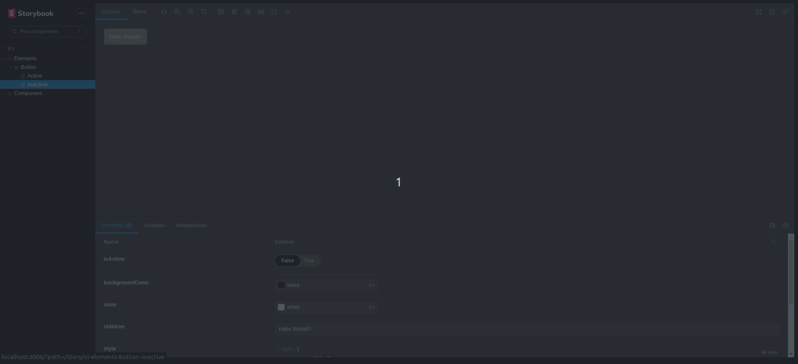
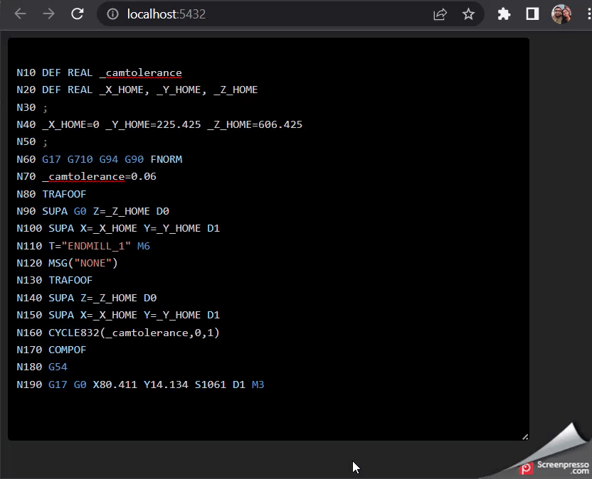

[](https://www.codefactor.io/repository/github/amitkshirsagar13/editor-components)
[](https://github.com/amitkshirsagar13/editor-components)
[](https://github.com/amitkshirsagar13/editor-components/issues)

# Editor Components

## GCode Editor

Allows developer to give Editor with GCode syntax highlighting

### Create React project with installed package

```
npm i @amitkshirsagar/editor-components
```

### Run storybook

```
npm start
```



### Demo nc-editor


